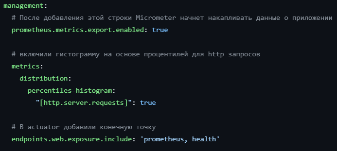
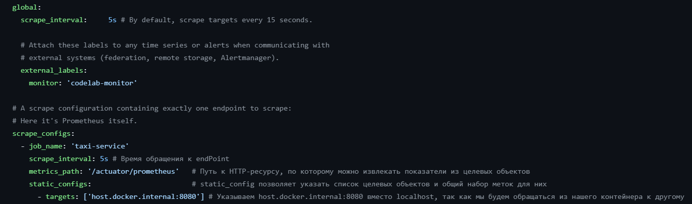
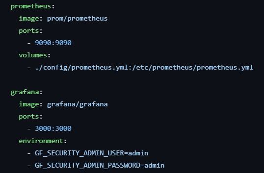

# Планировщик для Yandex такси
Система представляет собой приложение, которое с помощью API получает информацию о цене поездки для определенного маршрута. 

# Основные компоненты подсистемы

- ### YandexScheduler
В данной компоненте каждые 30 секунд вызывается метод для обновления цены.

- ### TaxiService
Предоставляет функциональность для получения и сохранения информации о цене поездки.
С помощью MeterRegistry в конструкторе создается метрика priceTaxi, связанная с переменной price, которая представляет текущую цену поездки.

- ### TaxiApiClient
Компонент, который предоставляет клиентский интерфейс для взаимодействия с API.  
С помощью аннотации '@Timed' из библиотеки micrometer измеряется временя выполнения метода 'getPrice()'.
Это позваоляет собирать информацию о производительности запросов к API.

- ### PriceRepository
Репозиторий, используется для взаимодействия с БД.
Аналогично с TaxiApiClient, используется аннотация @Timed, PriceRepository вносит ту же функциональность мониторинга производительности, позволяя измерять время выполнения операции извлечения всех цен из БД.

# Prometheus + Grafana
В файле application.yaml добавили нужные строки для prometheus  

Мы будем запускать Prometheus локально в контейнере Docker, поэтому нам понадобятся некоторые конфигурации из файла prometheus.yml

Добавили контейнеры prometheus и grafana в docker-compose   

# Инструкция для запуска
*  сборка проекта  
`mvc clean package`   

* сборка образа taxi-service   
`docker build -t taxi-service:latest .` 

* запуск контейнера  
`docker compose up`    
 

Получение всех цен из БД  
`http://localhost:8080/prices`

Prometheus  
`http://localhost:9090`  

Grafana  
`http://localhost:3000`

### Установка Grafana
Grafana работает на localhost с портом 3000

`http://localhost:3000`

В настройках указать сервер prometheus

В директории `config` находятся две стандартные метрики по jvm и по spring boot, но также есть и кастомная `Simple dashboard`

